# Stellarium - Game Design Document

## Narrative & Scenario

### General Description

Stellarium is a survival game set in space, where the player explores various planets using fully customizable spaceships. Throughout the journey, the player builds bases, collects resources, and faces hostile alien fauna. The ultimate goal: defeat a gargantuan cosmic entity threatening Earth.

---

### Context

You are an astronaut living on modern-day Earth in the year 2025. Scientists observe strange phenomena in deep space—anomalies that reveal the presence of a massive celestial creature the size of a planet. It moves unpredictably through the solar system and threatens to annihilate all life. You are chosen for a high-risk mission: travel into space, adapt to alien worlds, and find a way to destroy it.

---

## Story Arcs

### 🪐 Earth Arc

You begin your journey by being summoned to the tallest tower in the city to meet the director of NASA. He informs you of the apocalyptic threat and instructs you to gather the resources necessary to construct a spaceship. Once completed, he teaches you how to launch into space.

### 🏜️ Miraju Arc

Upon reaching space, you're guided to land on the planet Miraju—the only planet with a breathable atmosphere. There, the director explains that to survive on other toxic planets, you'll need to craft a **Strength Potion** that alters your metabolism. Once consumed, you're free to explore all other planets except Vesus.

### 🌲 Mitsurin / 🌋 Funka / ❄️ Kagami Arc

Every time you visit a new planet, the director contacts you to describe its characteristics and offer tips. After exploring all three, you're instructed to brew and drink a **Superior Regeneration Potion** to adapt your body to the antimatter-charged atmosphere of Vesus.

### 🌌 Vesus Arc

Upon arriving on Vesus, you're briefed on the special weapons required to defeat **Eclipse**. Step by step, you're tasked with obtaining an **antimatter turret**, an **antimatter bomb**, and finally, a **cosmic armor**. The director provides strategic advice to help prepare for the confrontation.

### ☄️ Eclipse Arc

As Eclipse enters its second phase, the director calls again to support you. He motivates and advises you through the final battle. Upon victory, he congratulates you.

---

## Final Boss - Eclipse

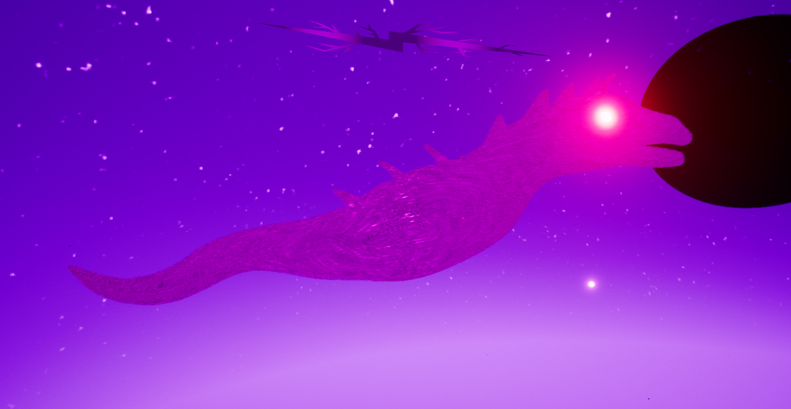

**Eclipse** is so massive it can be seen from any location in the star system. It moves erratically and can destroy entire planets. It becomes aggressive if approached and unleashes devastating attacks:

* Gamma burst
* Cosmic body collision
* Cosmic breath (strong knockback)
* Cosmic pull (gravitational suction)
* Star control (summons stars as projectiles)
* Antimatter explosion (after a 30-second charge)

### Phase Two:

Activated at low health, Eclipse becomes faster and more dangerous:

* 1.5× speed
* Damage aura around the head
* Increased meteor frequency

---

## Character Progression & Attributes

### Leveling System

* Your character starts at level 1 and can reach level 100 by gaining experience and unlocking achievements (99 in total).
* Experience is earned by killing creatures or crafting items.
* XP required per level: `100 + current level * 10`

  * \~3,000 XP to reach level 20
  * \~11,000 XP to reach level 50
  * \~35,000 XP to reach level 100
* Unlocking each level requires validating one new achievement.
* Each level grants a new craft and one skill point to improve a stat.

### Stats

The character has several upgradable stats:

* **Health**: 100 base, +10/pt
  Vital to survival. Damage comes from enemies, hunger, cold, heat, falls, crashes, or lack of oxygen. Heals over time depending on hunger level and can be restored with potions. Movement is slowed under 50 HP.

* **Stamina**: 100 base, +10/pt
  Affects sprint duration and jump height. Regenerates over time, faster with high hunger, but drains hunger and thirst.

* **Carry Weight**: 100 base, +10/pt
  Maximum inventory capacity before being slowed.

* **Speed**: 100 base, +2/pt
  Determines movement speed. Sprinting is 50% faster.

* **Hunger**: 100% base, +10/pt
  Low hunger causes damage. High hunger regenerates health and stamina, and increases cold resistance.

* **Hydration**: 100 base, +10/pt
  Low hydration causes damage and reduces speed/stamina. High hydration boosts heat resistance and jump height.

* **Torpor**: 100 base, +30/pt
  Represents consciousness level. High torpor causes nausea and slowness; max torpor knocks you out.

* **Aquatic Affinity**: 30s underwater breathing base, +60s/pt
  Also increases swimming speed (+10%/pt).

* **Repair Skill**:
  Unlocks object repair at reduced costs.
  Costs: lvl1 – full price, lvl2 – 80%, lvl3 – 60%, lvl4 – 45%, lvl5 – 30%

* **Crafting Skill**:
  Increases item effectiveness (+10%/pt). Grants crafted gear a pre-equipped mod at lvl 3, and two at lvl 5.

* **Stealth**:
  Reduces detection range by creatures.
  Ranges: lvl1 x1.0, lvl2 x1.5, lvl3 x2.0, lvl4 x2.5, lvl5 x3.0

* **Climbing**:
  Allows climbing steeper surfaces.
  Angles: lvl1 – 40°, lvl2 – 52°, lvl3 – 65°, lvl4 – 78°, lvl5 – 90°
  Climbing speed also increases (+10%/pt).

* **Disease Resistance**:
  Decreases disease risk and transmission. Slows progression rate inside the body (+100% resistance/pt).

* **Sharpshooter**:
  Increases reload speed and projectile velocity (+10% per level).

---

## Achievements & Progression

In Stellarium, achievements are not just symbolic trophies—they are essential for progression. Each experience level must be validated by unlocking an achievement, making them a core part of the gameplay loop. Achievements span exploration, combat, taming, breeding, building, and more. Each one grants a point value representing its difficulty or rarity.

---

### Achievement List

1. Explore Miraju (2 pts)

2. Explore Mitsurin (2 pts)

3. Explore Funka (2 pts)

4. Explore Kagami (2 pts)

5. Explore Vesus (2 pts)

6. Defeat the boss of Miraju (4 pts)

7. Defeat the boss of Mitsurin (4 pts)

8. Defeat the boss of Funka (4 pts)

9. Defeat the boss of Kagami (4 pts)

10. Defeat the boss of Vesus (4 pts)

11. Kill one creature of every species on Miraju (2 pts)

12. ... on Mitsurin (2 pts)

13. ... on Funka (2 pts)

14. ... on Kagami (2 pts)

15. ... on Vesus (2 pts)

16. Reach outer space (2 pts)

17. Exceed 50,000 km/h (2 pts)

18. Pilot a spaceship with 40 parts (1 pt)

19. Pilot a spaceship with 120 parts (1 pt)

20. Kill a creature using a spaceship (2 pts)

21. Tame a passive creature (3 pts)

22. Tame an aggressive creature (4 pts)

23. Keep a tamed creature alive for over 10 days (3 pts)

24. Tame a pack leader with at least 3 members (3 pts)

25. Tame one creature of every species (3 pts)

26. Breed your creatures (3 pts)

27. Breed a tamed creature with a wild one (3 pts)

28. Obtain a mutation through breeding (3 pts)

29. Obtain a creature at level 11 (4 pts)

30. Obtain a creature at level 15 (2 pts)

31. Harvest a resource using a tool (2 pts)

32. Eat a fruit (1 pt)

33. Eat meat (2 pts)

34. Place a construction piece (1 pt)

35. Place a bed (2 pts)

36. Clone a creature (2 pts)

37. Cure a disease (2 pts)

38. Injure Eclipse (3 pts)

39. Resurrect (3 pts)

40. Kill Eclipse (1 pt)

---

Each unlocked achievement allows you to level up and unlock new crafting options, equipment, and zones to explore.

---

## Planetary System & Biomes

The world of Stellarium is made up of six unique planets, each gradually accessible through advanced equipment: thermal protection, air filtering, antimatter shielding, and more. To travel between them, players must use a spaceship.

Each planet contains dungeons (caves, ruins, structures) inhabited by hostile creatures and powerful bosses. Defeating these bosses grants valuable loot and unlocks achievements.

---

### 🌍 Earth

The starting planet features diverse environments: plains, mountains, lakes, rivers, ocean, beaches, forests, and a central city.

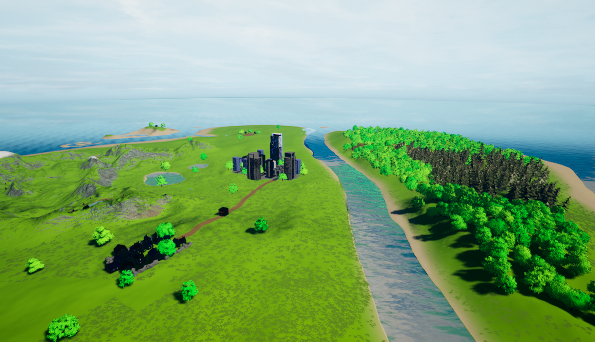

* Size: 1.2 km
* Temperature: 5°C to 25°C
* Difficulty: 1

---

### 🏜️ Miraju

A desert planet with three distinct areas: rocky plains, sand dunes, and a canyon leading to a hidden valley and temple. Occasional mirages may distort your perception.

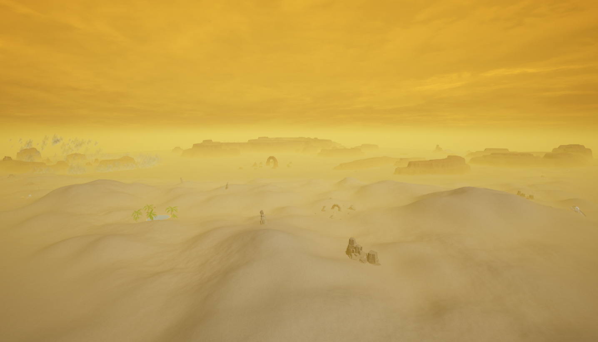

* Size: 2.5 km
* Temperature: -10°C to 55°C
* Difficulty: 3

---

### 🌿 Mitsurin

A lush green planet with dense jungles, vast plains, rivers, and a dark forest inhabited by dangerous creatures.

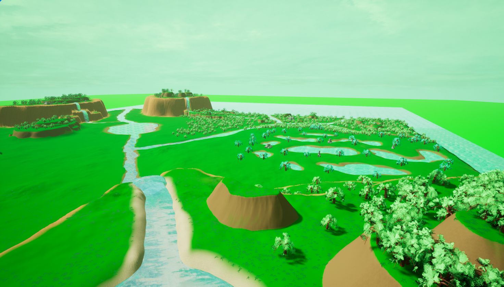

* Size: 2.2 km
* Temperature: 10°C to 45°C
* Difficulty: 5

---

### 🌋 Funka

A volcanic world covered in magma, rock, and ash. The sky is always dark. Several volcanoes, including a massive central one, dominate the terrain.

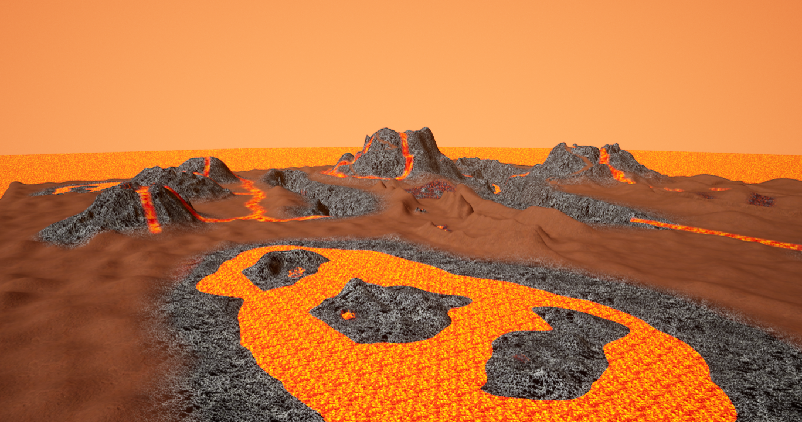

* Heat protection required
* Size: 2.0 km
* Temperature: 70°C to 115°C
* Difficulty: 7

---

### ❄️ Kagami

An icy planet with snow-covered mountains, frozen plains, icy lakes, and ice caves. Snowstorms are frequent.

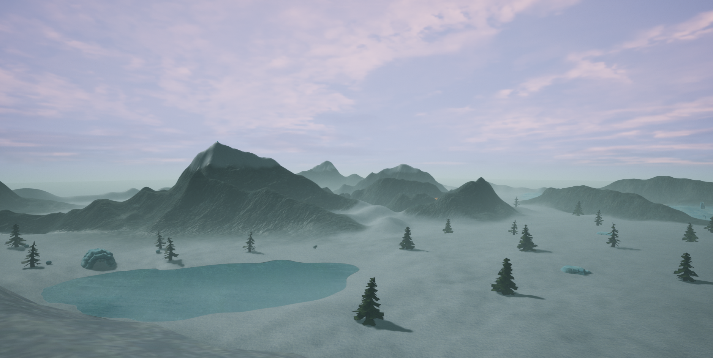

* Cold protection required
* Size: 2.0 km
* Temperature: -70°C to -20°C
* Difficulty: 8

---

### 🌌 Vesus

A stunning planet with glowing blue valleys, hills, and waterfalls. It is home to the universe's most advanced civilization, which becomes hostile upon detecting intruders.

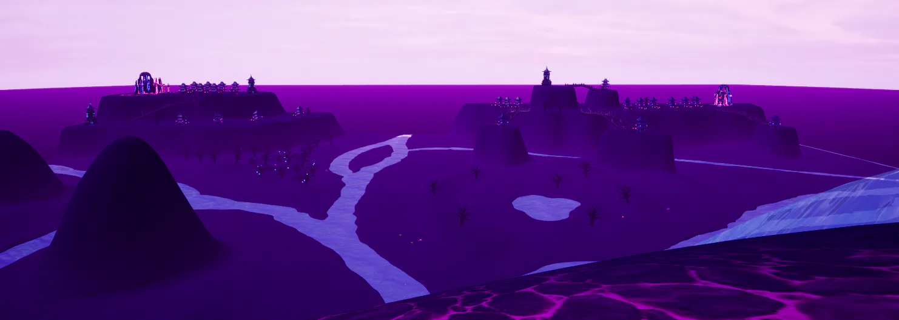

* Antimatter protection required
* Size: 2.0 km
* Temperature: -10°C to 10°C
* Difficulty: 10

---

## 🏗️ Construction System

### Ground Bases

The building system is based on modular construction blocks measuring 2m x 2m x 2m. Each piece can be crafted in various shapes and materials, allowing the creation of fully customized bases. Material choice affects both durability and weight.

Available shapes include:

* Square wall, Triangular wall, Wall with window
* Flat roof, Sloped roof, Rectangular roof, Sloped rectangular roof, Door

Each shape has a larger variant costing 4× more to place.

|  |  |  |
|:--:|:--:|:--:|

---

### Starships

Ships can be built from scratch using the same modular system as bases, allowing for creative flying structures of any size or shape.

* Speed depends on engine power, quantity, and total ship weight.
* A realistic balance system is used: unbalanced ships risk crashing.
* Players can control speed and direction in third-person view.
* Ships are fully pilotable.

|  |  |
|:--:|:--:|

---

### Domes and Large Structures

* Tek Dome: 30m radius, extremely durable
* Antimatter Dome: 80m radius, top-tier protection

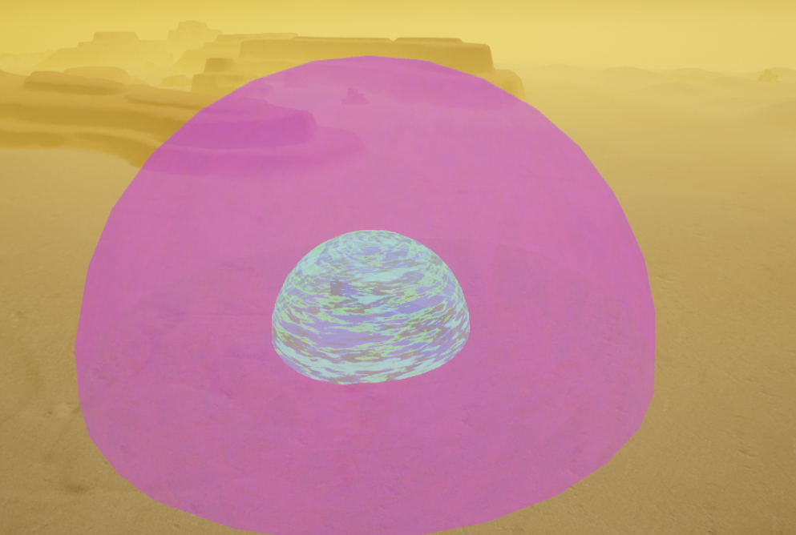

---

## 🧰 Items & Equipment

### Weapons

Weapons weigh 2kg each. Once crafted, they come with integrated ammunition:

* Spear: Durability 200, Damage 20, Melee
* Pistol: Durability 60, Damage 50, Range 0.02m
* Rocket Launcher: Damage 300, AoE 3m
* Laser Rifle: Damage 33, Durability 300, AoE 1m
* Tranquilizer Gun: Puts creatures to sleep
* Acid Rifle: Damage 150, slows by -60% for 60s
* Nuclear Bazooka: AoE 3m + radioactive zone
* Antimatter Rifle: Damage 100, AoE 5m
* Ice Gun: Freezes enemies for 8s
* Antimatter Bomb: 1,000,000 damage, 50km radius
* Telekinetic Rifle: Controls up to 1 ton remotely
* Ultimate Telekinator: Infinite mass control + resize targets (1%-1000%)

### Armor

Armor pieces weigh 10kg each:

* Metal Armor: -30% damage, durability 100
* Platinum Armor: -50%, durability 300
* Tek Armor: -70%, durability 1000
* Cosmic Armor: -60% base, -80% in space, stamina bonus, built-in totem

Upgrades include:

* Oxygen reserve, Cold/Heat resistance
* Fall resistance (-70% or -100%)
* Supersonic boots (x3), Ultrasonic boots (x9), Jetpack

### Building Materials

* Metal: Durability 2, 80kg
* Glass: Durability 1, 40kg
* Platinum: Durability 3, 60kg
* Crystal: Durability 2, 30kg
* Tek: Durability 4, 40kg
* Translucent Tek: Durability 3, 20kg
* Tek Dome: Durability 5, 30m radius
* Antimatter Dome: Durability 5, 80m radius

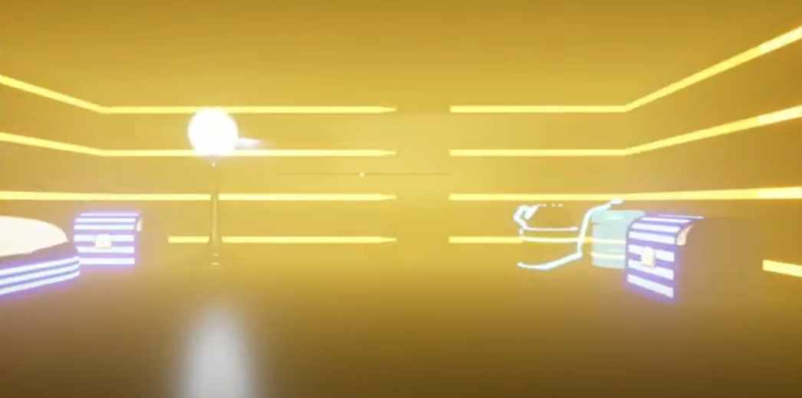

### Engines

* Thermal Reactor: 10,000N (fuel: oil)
* Nuclear Reactor: 100,000N (fuel: uranium)
* Antimatter Reactor: 1,000,000N (fuel: antimatter)

### Utilities

* Control Panel: Fly your ship
* Respawn Bed: Revive after death
* Storage Chest: Holds 30 slots
* Electrolyzer: Converts water into O2 and H2
* Tek Turret: Auto-shoots enemies
* Cloner: Clones creatures (costs plutonium)
* Teleport Portal: Teleports from point A to B

### Consumables & Tools

* Healing Potion: +1.25 HP/s for 1min
* Advanced Healing Potion: +2.5 HP/s +75 HP for 1.5min
* Vitality Potion: Restores stamina, removes torpor
* Strength Potion: Infinite weight & hunger for 3min
* Cryopod: Carry creatures
* Teleport Gun: 10km range, swaps position if target is alive
* Time Remote: Slows time for 30s
* Pickaxe: Efficiency 130
* Drill: Efficiency 160
* Laser Tool: Efficiency 200

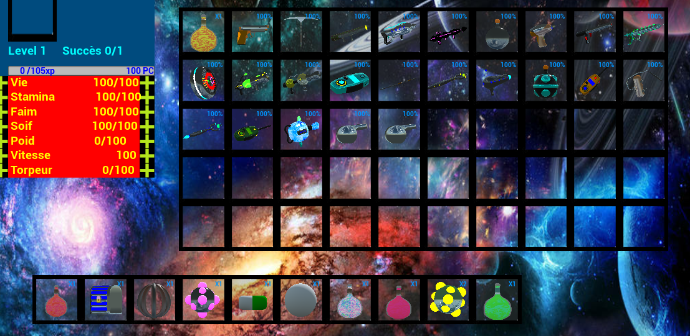

---

## 🛠️ Crafting System

Crafting in Stellarium is achieved through the discovery and unlocking of "engrams." Each engram represents a recipe that requires specific resources and grants experience (XP) upon crafting. Players must collect raw materials throughout the universe and refine them into powerful tools, structures, weapons, potions, and equipment.

Below is a non-exhaustive list of craftable engrams, sorted by progression:

---

### 🔧 Basic Equipment & Structures

* **Pickaxe** (2 steel) – 20 XP
* **Metal wall** (3 steel) – 25 XP
* **Thermal Reactor** (5 steel, 3 oil) – 60 XP
* **Control Panel** (10 steel, 5 sand) – 100 XP
* **Respawn Bed** (5 steel, 1 fur) – 60 XP
* **Spear** (6 steel, 3 hide) – 60 XP
* **Storage Chest** (5 steel) – 40 XP
* **Canteen** (3 steel) – 25 XP
* **Glass wall** (4 coal, 8 sand) – 40 XP

---

### 🛡️ Armor, Weapons & Potions

* **Metal Armor** (10 steel, 5 hide) – 120 XP
* **Heat Resistance** (8 hide) – 60 XP
* **Pistol** (5 steel, 5 coal, 5 sulfur) – 150 XP
* **Cold Resistance** (5 fur) – 80 XP
* **Lantern** (1 oil, 2 sand) – 20 XP
* **Fall Resistance** (10 hide) – 70 XP
* **Whistle** (1 platinum) – 20 XP
* **Strength Potion** (2 dried fruit, 2 oil, 2 dried meat) – 20 XP
* **Flamethrower** (10 steel, 5 coal, 5 oil, 10 sulfur) – 200 XP

---

### 🏗️ Advanced Construction

* **Platinum Wall** (3 platinum) – 45 XP
* **Colossal Wall** (8 steel) – 80 XP
* **Feeder** (5 steel) – 50 XP
* **Colossal Door** (8 steel) – 80 XP
* **Vitality Potion** (2 rotten fruit, 2 oil, 2 rotten meat) – 20 XP
* **Platinum Armor** (8 hide, 12 platinum) – 240 XP
* **Rocket Launcher** (8 platinum, 5 coal, 10 sulfur) – 200 XP

---

### ⚙️ High-Tech Items & Utilities

* **Water Synthesizer** (5 steel, 4 crystal) – 120 XP
* **Nuclear Reactor** (5 platinum, 2 uranium) – 180 XP
* **Healing Potion** (3 rotten fruit, 3 dried fruit, 3 sulfur) – 30 XP
* **Tranquilizer Rifle** (12 rotten fruit, 5 platinum, 5 sulfur) – 250 XP
* **Drill** (3 pearl, 5 platinum) – 150 XP
* **Crystal Wall** (1 crystal) – 18 XP
* **Laser Rifle** (2 diamond, 2 oil) – 180 XP

---

### 🧪 Special Upgrades & Enhancements

* **Heat Resistance++** (2 ice heart, 1 diamond) – 150 XP
* **Saddle Chest** (5 steel, 2 pearl) – 120 XP
* **Cold Resistance++** (2 magma heart, 1 uranium) – 150 XP
* **Super Lantern** (2 crystal, 1 dazzling shard) – 60 XP
* **Fall Resistance++** (10 fur, 6 glue) – 250 XP
* **Antidote** (1 acid, 1 rotten fruit, 1 dried fruit, 3 sulfur) – 50 XP
* **Acid Rifle** (10 acid, 4 glue, 8 platinum) – 350 XP
* **Teleportation Portal** (12 crystal, 8 diamond, 5 pearl, 3 uranium) – 800 XP

---

### 🧬 Cutting-Edge Tech

* **Advanced Canteen** (3 crystal, 1 diamond, 1 pearl) – 150 XP
* **Ice Gun** (2 ice heart, 5 crystal) – 200 XP
* **Cryopod** (2 crystal, 1 diamond, 1 dazzling shard, 1 pearl) – 200 XP
* **Healing Syringe** (3 cryogenic fruit, 3 flaming fruit, 2 acid) – 50 XP
* **Advanced Feeder** (2 diamond, 6 platinum) – 200 XP
* **Nuclear Bazooka** (10 platinum, 5 uranium, 3 acid) – 450 XP
* **Laser Ship Gun** (3 diamond, 3 oil) – 200 XP
* **Nuclear Thermo Bomb** (3 platinum, 1 uranium, 1 magma heart) – 100 XP
* **Advanced Control Panel** (5 diamond, 3 uranium) – 400 XP
* **Super Healing Potion** (3 cryogenic fruit, 3 flaming fruit, 1 blue sulfur) – 150 XP

---

### 🧲 Elite Equipment

* **Gravity Remote** (5 platinum, 8 uranium, 5 flaming fruit) – 500 XP
* **Tek Wall** (3 diamond) – 100 XP
* **Tek Armor** (12 crystal, 12 diamond, 12 hide) – 900 XP
* **Deployable Cage** (10 steel, 1 acid, 1 glue) – 150 XP
* **Tek Dome** (15 diamond, 3 uranium) – 900 XP
* **Creature Cloner** (8 diamond, 50 duplication shards) – 1000 XP
* **Laser Tool** (1 diamond, 5 platinum, 2 uranium) – 200 XP
* **Jetpack** (8 diamond, 3 plutonium) – 600 XP
* **Telekinetic Rifle** (10 platinum, 2 plutonium, 10 sulfur) – 400 XP
* **Supersonic Boots** (8 diamond, 5 plutonium) – 700 XP
* **Translucent Tek Wall** (1 acid, 3 crystal, 3 diamond) – 150 XP
* **Antimatter Rifle** (5 antimatter, 3 magnetite) – 500 XP
* **Antimatter Reactor** (3 antimatter, 2 magnetite) – 300 XP
* **Tranquilizer++ Rifle** (10 acid, 12 platinum, 12 smoke powder) – 600 XP
* **Teleport Gun** (3 teleport DNA, 3 diamond, 1 plutonium) – 350 XP
* **Antimatter Ship Gun** (5 antimatter, 3 magnetite) – 500 XP
* **Sleep Bomb** (3 hide, 1 smoke powder, 1 blue sulfur) – 100 XP
* **Aging Remote** (5 growth DNA, 3 moon fruit, 3 platinum) – 250 XP
* **Antimatter Bomb** (2 antimatter, 1 magnetite) – 200 XP
* **Area Uploader** (5 diamond, 5 magnetite, 8 plutonium) – 1200 XP
* **Supersonic Jetpack** (5 magnetite, 6 plutonium) – 800 XP
* **Ultimate Telekinator** (8 magnetite, 6 plutonium, 1 blue sulfur) – 900 XP
* **Antimatter Dome** (10 antimatter, 3 magnetite) – 900 XP
* **Megasonic Boots** (10 magnetite, 10 plutonium) – 1000 XP
* **Magnetic Field Generator** (12 antimatter, 12 magnetite, 6 blue sulfur) – 2000 XP

---

### 🗝️ Secret Items

* Oblivion Potion
* Cosmic Armor
* Time Remote

---

## ⚗️ Materials Reference

**Common Resources**
Sand, Coal, Sulfur, Oil, Steel, Crystal, Platinum, Pearl, Diamond, Uranium, Plutonium, Magnetite, Antimatter

**Biological Components**
Fur, Hide, Glue, Acid, Smoke Powder, Magma Heart, Ice Heart, Dazzling Shard, Growth DNA, Teleport DNA, Duplication Shard

**Consumables**
Red Meat, Dried Meat, Rotten Meat, Flaming Meat (propulsion, -3 HP), Cryogenic Meat (+10% stamina, -3 HP), Lunar Meat (+5% HP)

**Fruits**
Apple, Dried Fruit (-2% torpor, -2 thirst), Rotten Fruit (+2% thirst & torpor), Flaming Fruit (propulsion, -2 HP), Cryogenic Fruit (+5% stamina, -2 HP), Moon Fruit (+3% HP)

---

### 🧬 Disease System

Diseases in Stellarium are infectious and can spread via contact. Each skill point invested in "Disease Resistance" increases the required transmission distance by 100% and slows the disease's development.

**Types of Diseases:**

* **Ciphilia**: Gradual stat weakening until death *(carrier: Vicilis)*
* **Alusphoria**: Causes hallucinations; player sees false entities *(carrier: Aranoide)*
* **Cecesia**: Leads to progressive blindness *(carrier: Dazzle)*
* **Hysteragia**: Triggers more frequent and violent rage bursts *(carrier: Tronvoide)*
* **Cocilia**: Induces extreme fatigue and potential fainting *(carrier: Cerval)*
* **Tetany**: Severely slows player movement *(carrier: Salavamander)*

---

### 🐾 Creature Behavior

Creatures in Stellarium follow diverse behavioral patterns:

* **Friendly**: Will follow the player peacefully if spotted
* **Weak**: Passive even when attacked
* **Passive**: Runs when attacked
* **Skittish**: Runs when detecting the player
* **Neutral**: Attacks only if provoked
* **Defensive**: Attacks if approached too closely
* **Aggressive**: Attacks on sight
* **Cowardly**: Aggressive when healthy, flees when injured

Other behaviors:

* Creatures may be **diurnal** or **nocturnal**, seeking food during active periods and returning to their nests to sleep.
* Wild babies remain in the nest and are fed by their mother.
* Wild creatures do not despawn—they persist unless killed or starved.
* Some species form **packs** led by an alpha. Taming the alpha brings the whole group under your control.

---

### 🍖 Taming System

To tame a creature:

* Feed it when it's hungry (hunger < 85%). Each feeding restores 5% hunger. Typically, feeding intervals average every 3 minutes.

* Creatures cannot eat if:

  * Aggressive
  * Sleeping
  * Recently fed (<30s ago)

* Each food item has a predefined taming efficiency, which decreases with level using the formula:

  `efficiency = base / (1 + level * 0.3)`

* Damage resets the taming bar. Tranquilizer weapons can help manage aggression.

Once tamed, creatures can follow, fight alongside you, or be ridden—if size permits.

---

### 📊 Creature Statistics

Creatures in Stellarium have evolving stats based on their level, age, and assigned skill points:

* **Health**: +10% per skill point (SP)
* **Damage**: +6% per SP
* **Stamina**: +10% per SP
* **Speed**: +3% per SP
* **Special Ability**: +8% per SP
* **Special Stamina**: +12% per SP
* **Weight Capacity**: +5% per level

**Details:**

* Each creature has a unique special ability whose efficiency scales with the "special" stat. Using this ability consumes special stamina.

* Creatures can also have one or more **abilities**, such as:

  * Flying, gliding, climbing, digging
  * Sprint x3
  * Faster special regeneration under specific conditions (snow, lava…)
  * Immunities: fire, cold, torpor, poison, disease, radiation
  * Infinite oxygen
  * Invisibility when under 33% health
  * Stamina / special stamina drain on enemies

* **Size** depends on age and level:

  * 20% at birth
  * 100% at adulthood
  * 130% at 2× adult age
  * 90% at 25× adult age (aging)

* **Weight capacity** determines how much a creature can carry. It scales only with level.

---

### 🧬 Creature Breeding

Breeding allows you to obtain creatures with stats randomly inherited from both parents.

**Breeding Conditions:**

* Both creatures must not have recently bred
* Health ≥ 90%
* Food ≥ 70%
* Ideal ambient temperature
* Sufficient proximity

**Mutation System:**

* Stat mutation chance: **11.6%** per birth
* Double mutation chance: **3.6%**
* Mutations also affect creature color

Incubation and maturation times depend on the species.

---

### 🐾 Creature Sheets

---

#### 🐺 Wolf

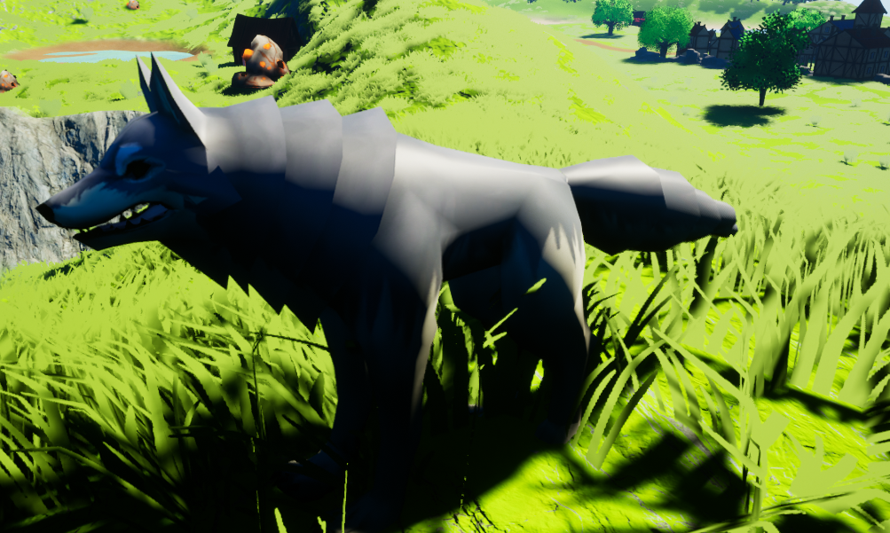

A classic predator living in forests and mountains. Often hunts in packs and will attack if a foreign presence is detected. Not mountable.

---

#### 🐻 Bear

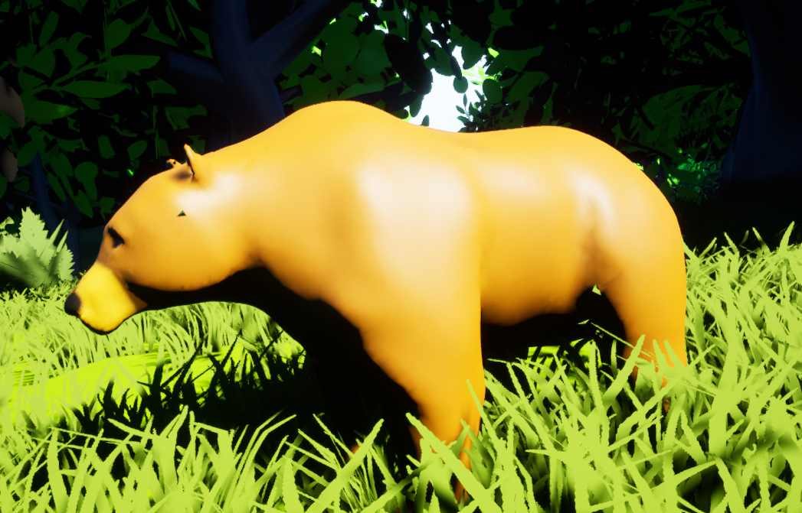

Strong and powerful, the bear is an omnivore that aggressively defends its territory. It has a passive special ability: the lower its health, the stronger its attacks become. Mountable.

---

#### 🐑 Sheep

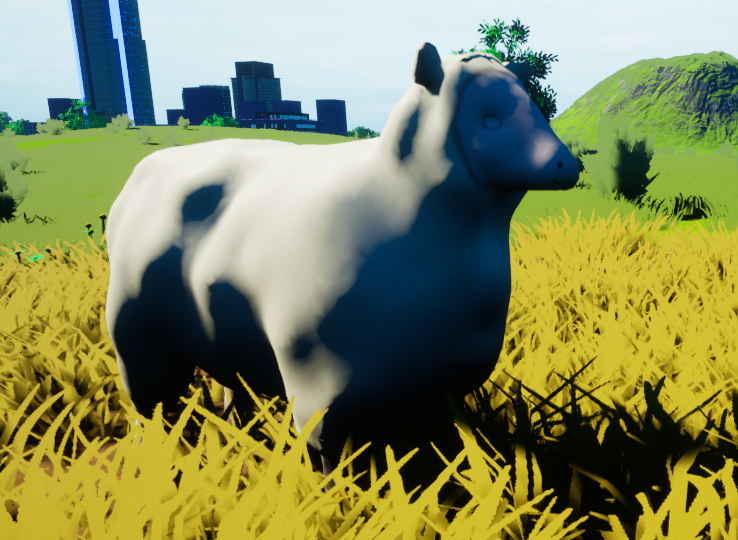

A peaceful plains-dweller, the sheep flees from threats. Can be used for its wool or as a light mount. Extremely vulnerable.

---

#### 🧬 Tardigramorph

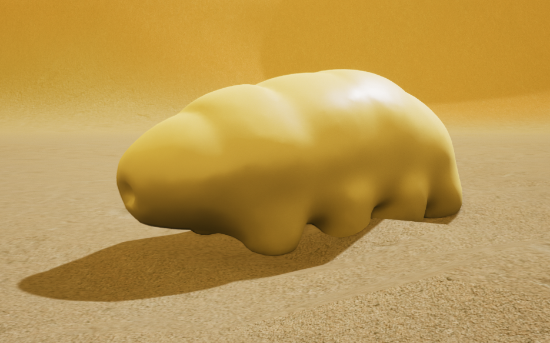

Inspired by Earth's tardigrade, this giant version is nearly indestructible. It can glide through the air and is immune to all environments. Its special ability makes it temporarily invincible. Variants exist on Kagami (ice) and Funka (fire).

---

#### 🐍 Slawormon

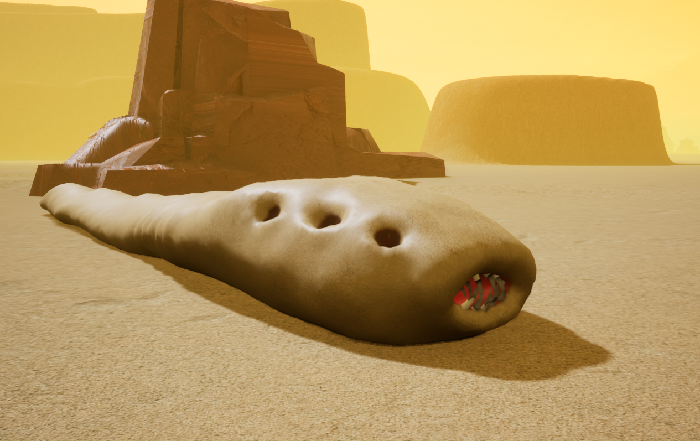

A giant, cowardly creature that flees when injured but deals heavy damage through its special ability: it causes a sand shockwave that launches enemies into the air. An orange variant becomes faster at low health but attacks less frequently.

---

#### 🐫 Muddy

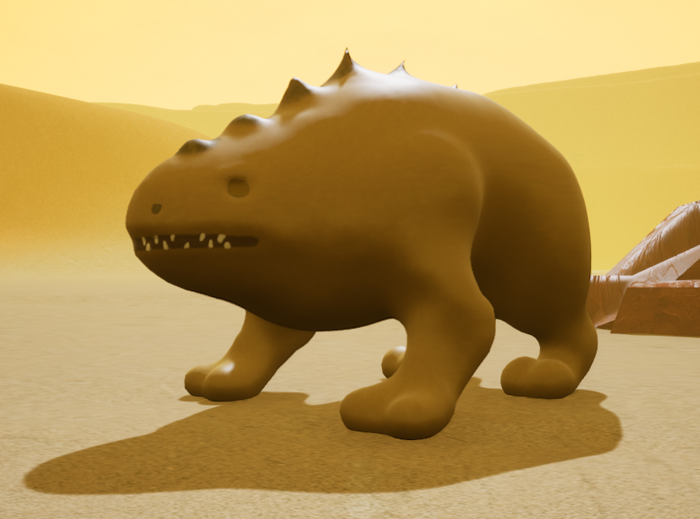

A massive herbivore from Miraju, this skittish creature uses sandstorms to weaken enemies and boost allies. Its storm causes continuous damage while regenerating nearby allies' stamina.

---

#### 🪨 Golem

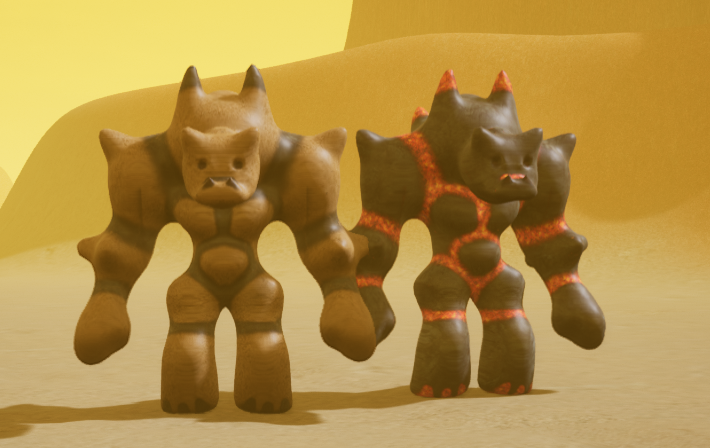

A massive stone creature inhabiting Miraju’s deserts. Harmless unless attacked, it becomes devastating when provoked, throwing boulders that deal heavy damage. A fire variant on Funka throws flaming rocks and is fire-immune.

---

#### 🕷️ Aranoide

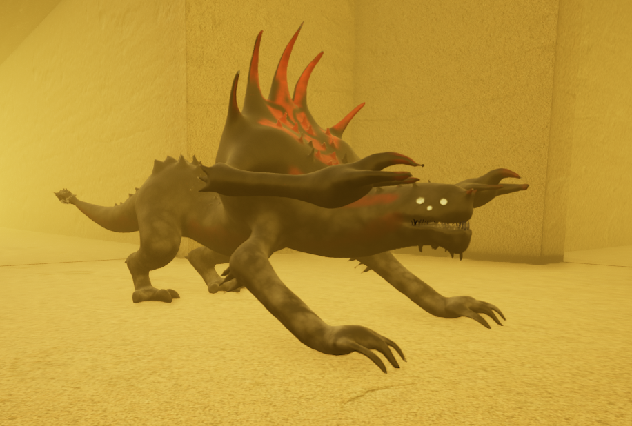

A giant spider-like nocturnal creature. Highly aggressive, it can launch sticky traps that slow down its targets. Dangerous especially at night.

---

#### 🌱 Sower

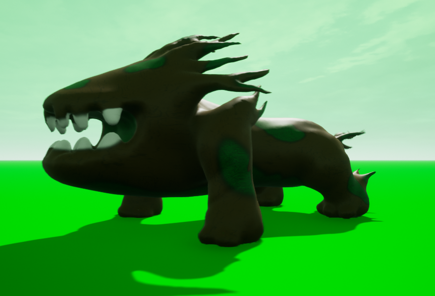

A plant-based creature living in Mitsurin’s gloomy forests. Releases seed clouds that drain the life energy of enemies. A turquoise variant has faster stamina regeneration and draining abilities.

---

#### 🦌 Cerval

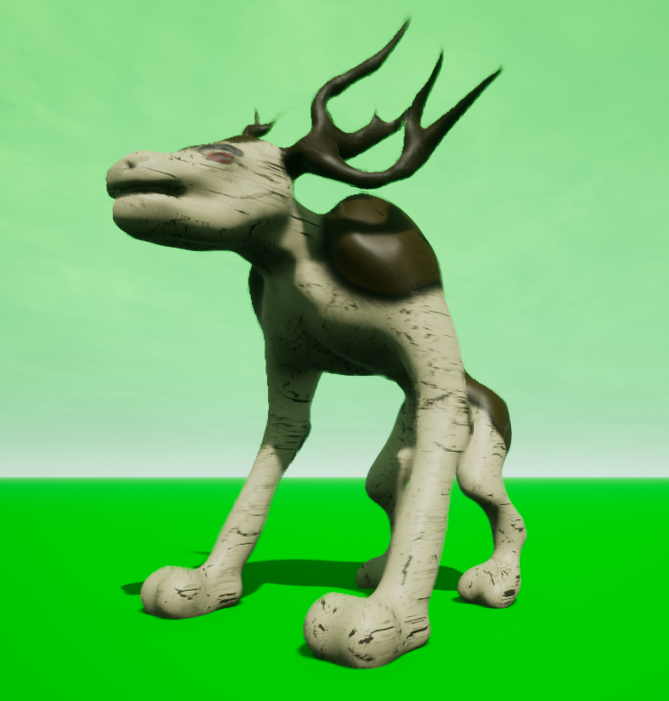

A strange, partially carnivorous bipedal deer capable of putting enemies to sleep with soporific mist. Combines speed with crowd control. Immune to torpor. Mountable.

---

#### 🧪 Vicilis

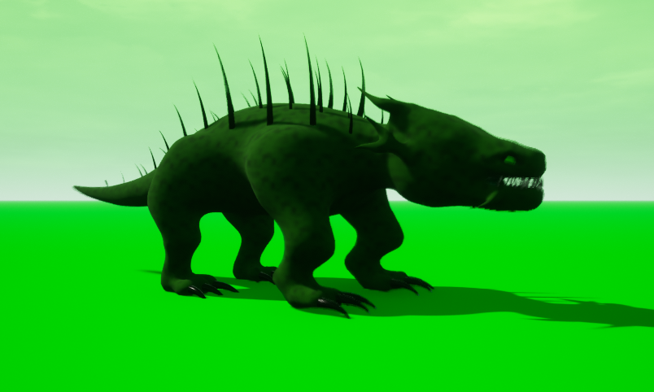

An aggressive creature with toxic fangs. Can grow vines to trap enemies or navigate terrain. A darker variant can paralyze but loses its draining ability. Excellent for battlefield control.

---

#### 🐘 Bibou

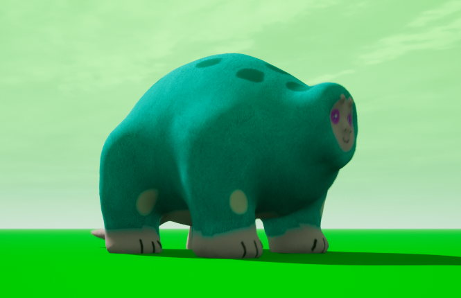

A peaceful giant herbivore. Slow but very durable, it can incubate eggs to increase mutation chances. Great for breeding purposes.

---

#### 🔥 Salavamandre

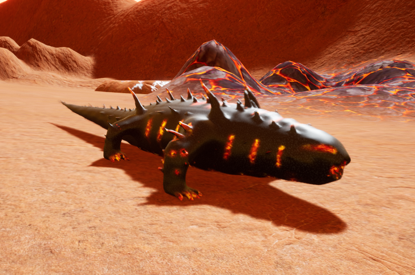

A volcanic salamander living in fissures. Can climb walls and shoot lava balls that burn on impact. An orange variant shoots three weaker fireballs. Mountable.

---

#### 🔥 Chrysomancer

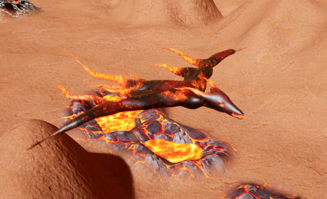

A flaming flying creature that crashes onto enemies in fiery explosions. Extremely fast and dangerous. A blue variant is more enduring but lacks special abilities. Mountable.

---

#### 🌋 Erudon

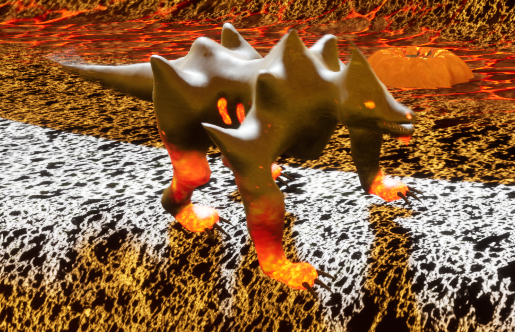

A massive fire-immune predator. Places explosive lava craters on the ground, ideal for traps. Mountable.

---

#### ❄️ Snow-Saurus

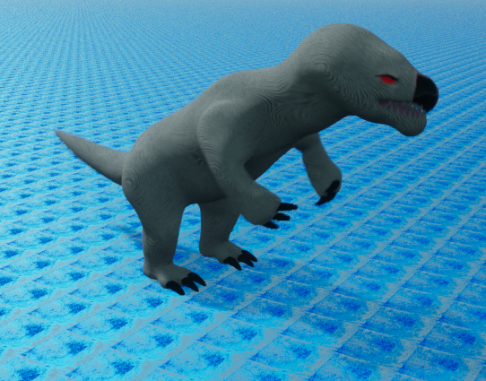

A hybrid between a Rex and a Yeti, this creature is built for snowy combat. Its ice breath deals heavy DPS and massive knockback. A light blue variant can summon snowstorms. Mountable.

---

#### ❄️ Reaper

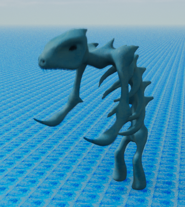

An ice creature with extendable claws. Can strike from a distance and launch enemies into the air. Excellent for crowd control. Immune to freezing. Mountable.

---

#### ❄️ Hazer

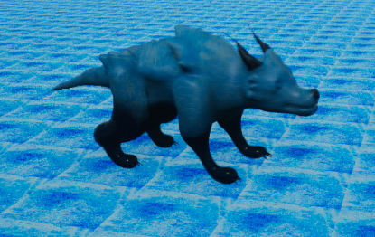

Wolf-like creature capable of creating illusions using a blizzard to confuse enemies. Great for deception. Mountable.

---

#### ✨ Dazzle

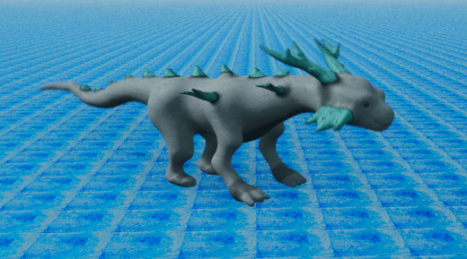

A massive creature from Kagami capable of blinding enemies with its intense light, disorienting them and making them lose track of their targets. Mountable.

---

#### 🌀 Tronvoide

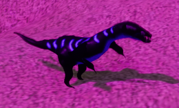

A small cowardly creature from Vesus that teleports behind enemies to ambush them. Mainly active at night. Not mountable.

---

#### ⛈️ Stormvoker

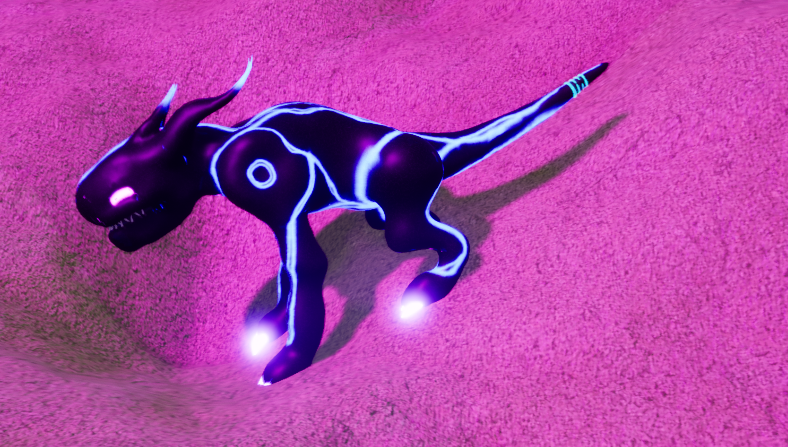

A colossus from Vesus that summons deadly storms, striking enemies with lightning. Pink variant causes longer but weaker storms. Mountable.

---

#### ⚛️ Negatron

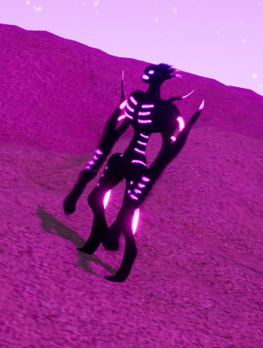

A civilized humanoid that manipulates antimatter. Teleports while dealing area damage before and after. Agile and can glide. Mountable.

---

#### 🌿 Hyppoglow

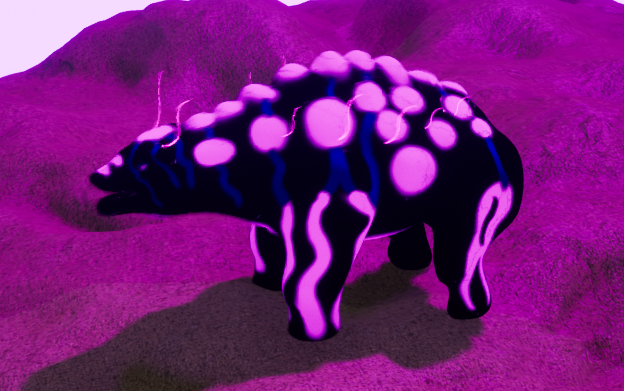

A peaceful berry-eater from Vesus. Highlights luminous ore veins nearby and has a unique ability to rejuvenate allies. Mountable.

---
