# Stellarium - Cahier de Game Design

## Narration & Scénario

### Description Générale

Stellarium est un jeu de survie spatial dans lequel le joueur explore différentes planètes à l’aide de vaisseaux entièrement personnalisables. Tout au long de l’aventure, le joueur construit des bases, récolte des ressources et affronte une faune extraterrestre hostile. L’objectif ultime : vaincre une entité cosmique gigantesque menaçant la Terre.

---

### Contexte

Vous incarnez un astronaute vivant sur Terre en 2025. Des scientifiques détectent des phénomènes étranges dans le cosmos, révélant la présence d’une créature gigantesque de la taille d’une planète. Celle-ci dérive de manière chaotique dans le système stellaire et menace d’annihiler toute vie. Vous êtes choisi pour une mission à haut risque : explorer l’espace, vous adapter aux environnements hostiles, et trouver un moyen de la détruire.

---

## Arcs Narratifs

### 🪐 Arc Terre

Vous êtes convoqué dans la plus haute tour de la ville pour rencontrer le directeur de la NASA. Il vous informe de la menace cosmique et vous confie la mission de la neutraliser. Pour cela, vous devez rassembler les ressources nécessaires à la construction d’un vaisseau spatial. Une fois celui-ci terminé, il vous explique comment rejoindre l’espace.

### 🏜️ Arc Miraju

Une fois dans l’espace, il vous demande d’atterrir sur la planète Miraju, seule planète respirable pour un humain. Il vous explique qu’il faudra ensuite fabriquer une **Potion de Force** capable de transformer votre métabolisme pour résister à l’air toxique des autres planètes. Une fois la potion bue, il vous encourage à explorer les autres planètes à l’exception de Vesus.

### 🌲 Mitsurin / 🌋 Funka / ❄️ Kagami

À chaque nouvelle planète explorée, le directeur vous contacte pour vous la présenter brièvement et vous donner des conseils. Une fois les trois explorées, il vous demande de fabriquer et consommer une **Potion de Régénération Supérieure** pour vous adapter à l’atmosphère chargée en antimatière de Vesus.

### 🌌 Arc Vesus

Dès votre arrivée sur Vesus, il vous guide dans l’obtention des armes nécessaires pour affronter **Eclipse**. Il vous indique comment fabriquer une **tourelle à antimatière**, une **bombe à antimatière**, puis une **armure cosmique**, tout en vous assistant à chaque étape.

### ☄️ Arc Eclipse

Lorsque Eclipse entre en phase 2, le directeur vous encourage et continue de vous conseiller pendant le combat. Une fois la créature vaincue, il vous adresse ses félicitations.

---

## Boss Final - Eclipse

**Eclipse** est si immense qu’on peut l’apercevoir depuis n’importe quel point du système stellaire. Il se déplace aléatoirement et peut détruire des planètes entières. Il devient agressif si on l’approche de trop près, et déclenche des attaques surpuissantes :

* Sursaut gamma
* Collision corporelle
* Souffle cosmique (recul violent)
* Aspiration cosmique (vous attire vers lui)
* Contrôle stellaire (projette des étoiles)
* Explosion d’antimatière (après 30s de chargement)

### Phase Deux :

Activée lorsqu’il a perdu beaucoup de vie, cette phase le rend bien plus dangereux :

* Vitesse x1,5
* Aura autour de la tête infligeant des dégâts
* Fréquence accrue de météores

---

## Progression du Personnage & Statistiques

### Système de Niveaux

* Le personnage commence au niveau 1 et peut atteindre le niveau 100 en gagnant de l’expérience et en débloquant des succès (99 au total).
* L’expérience est obtenue en tuant des créatures ou en fabriquant des objets.
* XP nécessaire par niveau : `100 + niveau actuel * 10`

  * \~3 000 XP pour atteindre le niveau 20
  * \~11 000 XP pour le niveau 50
  * \~35 000 XP pour le niveau 100
* Chaque niveau nécessite la validation d’un succès.
* À chaque niveau : un nouvel objet à crafter et un point de compétence à répartir.

### Statistiques

Le personnage possède plusieurs statistiques améliorables :

* **Vie** : 100 de base, +10/pt
  Si elle atteint 0, vous mourrez. Subit des dégâts via ennemis, faim, froid, chaleur, chutes, crash, manque d’oxygène. Régénération passive selon la faim ou via potions. Mouvement ralenti sous 50 HP.

* **Stamina** : 100 de base, +10/pt
  Sprint, saut. Régénération selon faim, mais consomme faim et soif.

* **Poids** : 100 de base, +10/pt
  Capacité maximale de port avant ralentissement.

* **Vitesse** : 100 de base, +2/pt
  Vitesse de déplacement. Sprint = +50%.

* **Nourriture** : 100% de base, +10/pt
  Faim = dégâts. Plein = régénération + résistance au froid.

* **Hydratation** : 100 de base, +10/pt
  Soif = dégâts. Plein = vitesse, stamina, saut, résistance à la chaleur.

* **Torpeur** : 100 de base, +30/pt
  Niveau de conscience. Haut = nausées, lenteur. Max = évanouissement.

* **Affinité aquatique** : 30s sous l’eau de base, +60s/pt
  Vitesse de nage +10%/pt.

* **Réparation** :
  Débloque la réparation d’objets avec coûts réduits.
  Coûts : lvl1 – 100%, lvl2 – 80%, lvl3 – 60%, lvl4 – 45%, lvl5 – 30%

* **Fabrication** :
  Objets +10% efficaces/pt. Mod auto dès lvl3 (1), lvl5 (2).

* **Discrétion** :
  Moins détectable.
  Distances : lvl1 x1.0 → lvl5 x3.0

* **Escalade** :
  Pentes : lvl1 – 40° → lvl5 – 90°
  Vitesse d’escalade +10%/pt

* **Résistance maladie** :
  Moins de risques, de transmission, et ralentit l’évolution (+100%/pt).

* **Tireur** :
  Recharge et projectiles plus rapides (+10% par niveau)

---

## Succès et Progression

Dans Stellarium, les succès ne sont pas seulement des trophées symboliques : ils sont essentiels à la progression. Chaque niveau d’expérience doit être validé par un succès, rendant ces objectifs incontournables pour évoluer. Les succès couvrent l’exploration, le combat, l’apprivoisement, la reproduction, la construction et plus encore. Chaque succès accorde un nombre de points indiquant sa difficulté ou sa rareté.

---

### Liste des Succès

1. Explorer Miraju (2 pts)

2. Explorer Mitsurin (2 pts)

3. Explorer Funka (2 pts)

4. Explorer Kagami (2 pts)

5. Explorer Vesus (2 pts)

6. Vaincre le boss de Miraju (4 pts)

7. Vaincre le boss de Mitsurin (4 pts)

8. Vaincre le boss de Funka (4 pts)

9. Vaincre le boss de Kagami (4 pts)

10. Vaincre le boss de Vesus (4 pts)

11. Tuer une créature de chaque espèce de Miraju (2 pts)

12. ... de Mitsurin (2 pts)

13. ... de Funka (2 pts)

14. ... de Kagami (2 pts)

15. ... de Vesus (2 pts)

16. Atteindre l’espace (2 pts)

17. Dépasser 50 000 km/h (2 pts)

18. Piloter un vaisseau de 40 pièces (1 pt)

19. Piloter un vaisseau de 120 pièces (1 pt)

20. Tuer une créature avec un vaisseau (2 pts)

21. Apprivoiser une créature passive (3 pts)

22. Apprivoiser une créature agressive (4 pts)

23. Garder une créature apprivoisée pendant 10 jours (3 pts)

24. Apprivoiser un chef de meute de 3 membres minimum (3 pts)

25. Apprivoiser une créature de chaque espèce (3 pts)

26. Reproduire ses créatures (3 pts)

27. Reproduire une créature apprivoisée avec une sauvage (3 pts)

28. Obtenir une mutation lors d’une reproduction (3 pts)

29. Obtenir une créature niveau 11 (4 pts)

30. Obtenir une créature niveau 15 (2 pts)

31. Récolter une ressource avec un outil (2 pts)

32. Manger un fruit (1 pt)

33. Manger de la viande (2 pts)

34. Placer une construction (1 pt)

35. Poser un lit (2 pts)

36. Cloner une créature (2 pts)

37. Guérir d’une maladie (2 pts)

38. Blesser Eclipse (3 pts)

39. Ressusciter (3 pts)

40. Tuer Eclipse (1 pt)

---

Chaque succès complété permet de franchir un cap de niveau et ouvre la voie à de nouveaux crafts, équipements et zones à explorer.

---

## Système Planétaire & Biomes

Le monde de Stellarium est composé de six planètes uniques, accessibles progressivement grâce à des équipements plus avancés : protections thermiques, filtrage de l’air, résistance à l’antimatière, etc. Pour voyager entre elles, vous devez utiliser un vaisseau spatial.

Chaque planète contient des donjons (grottes, ruines, structures) peuplés de créatures hostiles, et parfois de créatures très puissantes faisant office de boss. En les battant, vous obtenez des récompenses rares et validez un succès.

---

### 🌍 Terre

Planète de départ à la géographie variée : plaines, montagnes, lacs, rivières, océan, plages, forêts, et une ville centrale.

* Taille : 1,2 km
* Température : 5°C à 25°C
* Difficulté : 1

---

### 🏜️ Miraju

Planète désertique divisée en trois zones : plaines rocheuses, dunes de sable, et canyon menant à une vallée cachée avec un temple. Des mirages peuvent perturber vos perceptions.

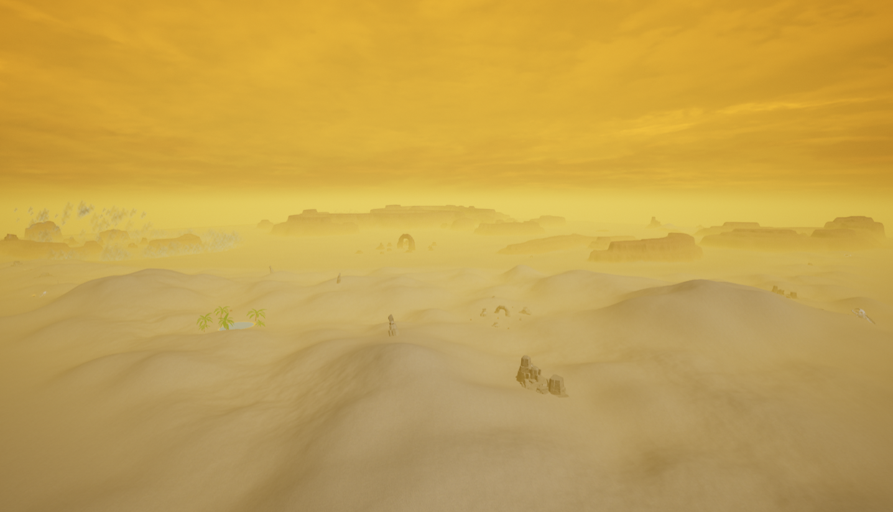

* Taille : 2,5 km
* Température : -10°C à 55°C
* Difficulté : 3

---

### 🌿 Mitsurin

Planète luxuriante composée de jungles denses, de vastes plaines, de rivières et d’une forêt lugubre abritant des créatures dangereuses.

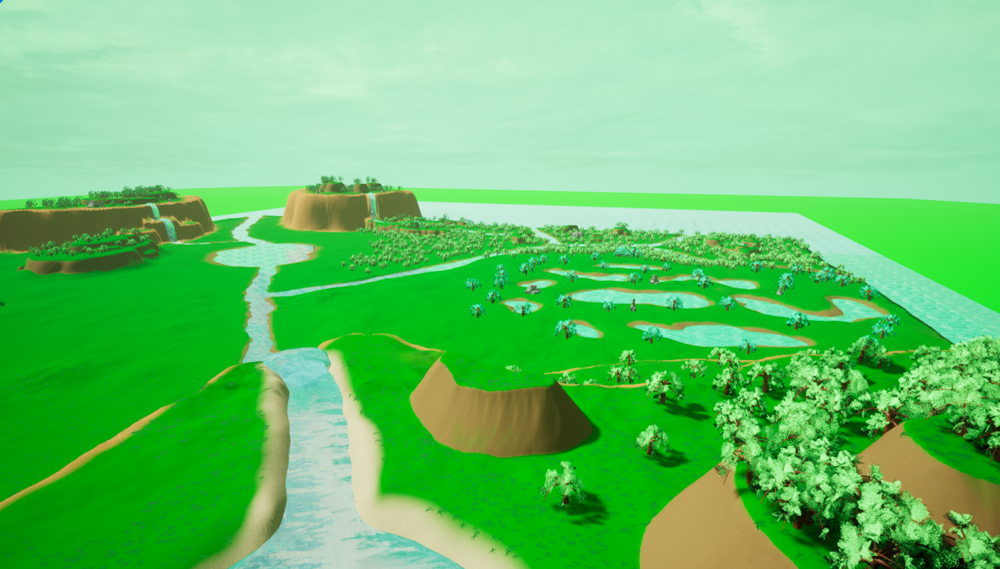

* Taille : 2,2 km
* Température : 10°C à 45°C
* Difficulté : 5

---

### 🌋 Funka

Monde volcanique recouvert de magma, de roche et de cendres. Le ciel est constamment obscurci. Plusieurs volcans, dont un central, dominent le paysage.

* Protection contre la chaleur requise
* Taille : 2,0 km
* Température : 70°C à 115°C
* Difficulté : 7

---

### ❄️ Kagami

Planète glacée composée de montagnes, plaines enneigées, lacs gelés et grottes de glace. Des tempêtes de neige y sont fréquentes.

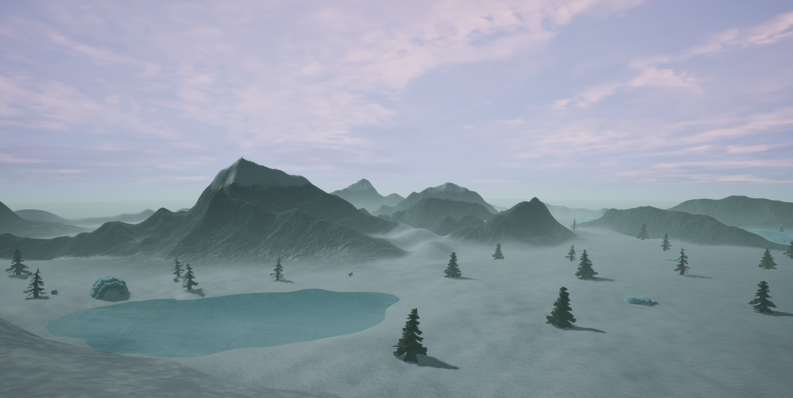

* Protection contre le froid requise
* Taille : 2,0 km
* Température : -70°C à -20°C
* Difficulté : 8

---

### 🌌 Vesus

Planète splendide à l’atmosphère fluorescente, faite de vallées, collines et cascades bleues. Elle abrite la civilisation la plus avancée de l’univers, peu accueillante envers les étrangers.

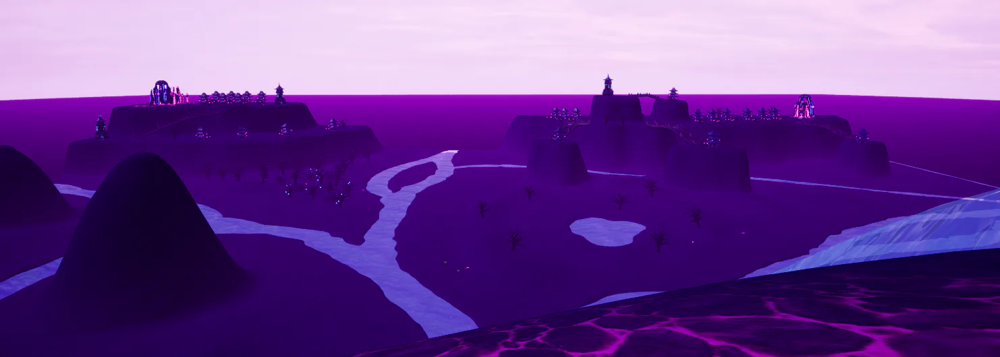

* Protection contre l’antimatière requise
* Taille : 2,0 km
* Température : -10°C à 10°C
* Difficulté : 10

---

## 🏗️ Système de Construction

### Bases Terrestres

Le système de construction est basé sur des blocs modulaires de 2m x 2m x 2m. Chaque pièce peut être fabriquée dans divers matériaux et formes, permettant de créer des bases entièrement personnalisées. Le choix du matériau influe sur la durabilité et le poids.

Formes disponibles :

* Mur carré, Mur triangulaire, Mur avec fenêtre
* Toit plat, Toit incliné, Toit rectangulaire, Toit rectangulaire incliné, Porte

Chaque forme existe également en version agrandie (coût x4).

---

### Vaisseaux

Les vaisseaux peuvent être construits de A à Z à l’aide du même système modulaire, permettant des structures volantes créatives de toute taille ou forme.

* La vitesse dépend de la puissance, du nombre de moteurs, et du poids total.
* Un système d’équilibrage réaliste est utilisé : les vaisseaux déséquilibrés risquent de s’écraser.
* Contrôle total en vue à la 3e personne.
* Vaisseaux pilotables.

---

### Dômes et Grandes Structures

* Dôme Tek : rayon de 30m, très résistant
* Dôme à antimatière : rayon de 80m, protection maximale

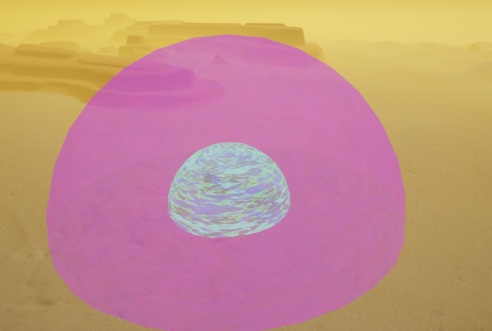

---

## 🧰 Objets & Équipements

### Armes

Les armes pèsent 2kg. Une fois fabriquées, elles possèdent leurs munitions intégrées :

* Lance : Durabilité 200, Dégâts 20, Corps à corps
* Pistolet : Durabilité 60, Dégâts 50, Portée 0.02m
* Lance-roquettes : Dégâts 300, Zone 3m
* Fusil laser : Dégâts 33, Durabilité 300, Zone 1m
* Fusil tranquillisant : Endort les créatures
* Fusil d’acide : Dégâts 150, ralentit -60% pendant 60s
* Bazooka nucléaire : Zone 3m + zone radioactive
* Fusil à antimatière : Dégâts 100, Zone 5m
* Pisto-Glace : Gèle les ennemis pendant 8s
* Bombe à antimatière : 1 000 000 dégâts, rayon 50km
* Fusil télékinésique : Contrôle des objets jusqu’à 1 tonne
* Télékinisateur ultime : Masse infinie + redimensionnement des cibles (1%-1000%)

### Armures

Les armures pèsent 10kg chacune :

* Armure en métal : -30% dégâts, durabilité 100
* Armure en platine : -50%, durabilité 300
* Armure Tek : -70%, durabilité 1000
* Armure cosmique : -60% (sol), -80% (espace), bonus de stamina, totem intégré

Améliorations disponibles :

* Réserve d’oxygène, Résistance au froid / chaleur
* Résistance à la chute (-70% ou -100%)
* Bottes supersoniques (x3), Bottes ultrasoniques (x9), Jetpack

### Matériaux de Construction

* Métal : Solidité 2, 80kg
* Verre : Solidité 1, 40kg
* Platine : Solidité 3, 60kg
* Cristal : Solidité 2, 30kg
* Tek : Solidité 4, 40kg
* Tek translucide : Solidité 3, 20kg
* Dôme Tek : Solidité 5, rayon 30m
* Dôme à antimatière : Solidité 5, rayon 80m

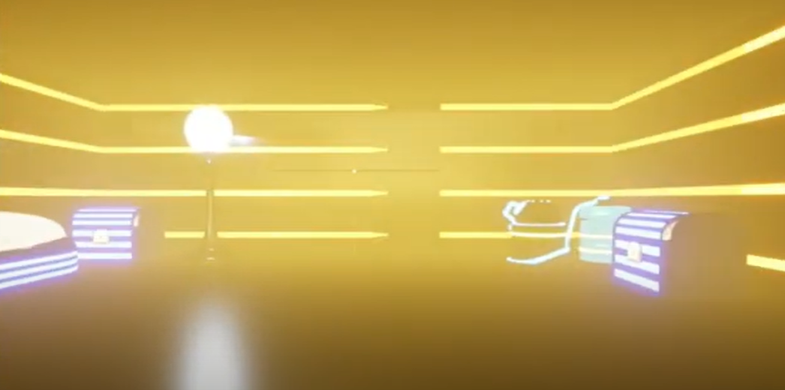

### Réacteurs

* Réacteur thermique : 10 000N (carburant : pétrole)
* Réacteur nucléaire : 100 000N (carburant : uranium)
* Réacteur à antimatière : 1 000 000N (carburant : antimatière)

### Utilitaires

* Tableau de bord : Contrôle du vaisseau
* Lit de réapparition : Résurrection après mort
* Coffre : 30 slots d’inventaire
* Électrolyseur : Convertit l’eau en O2 et H2
* Tourelle Tek : Tire automatiquement sur les intrus
* Cloneur : Clone des créatures (nécessite plutonium)
* Portail spatio-temporel : Téléportation point A à B

### Consommables & Outils

* Potion de soin : +1.25 HP/s pendant 1 min
* Potion de soin avancée : +2.5 HP/s +75 HP pendant 1.5 min
* Potion de vitalité : Restaure la stamina, supprime la torpeur
* Potion de force : Poids infini + faim désactivée pendant 3 min
* Cryopode : Transport de créatures
* Pistolet de téléportation : 10 km, échange de position
* Télécommande temporelle : Ralentit le temps pendant 30s
* Pioche : Efficacité 130
* Perceuse : Efficacité 160
* Outil laser : Efficacité 200

---

### 🧬 Système de Maladies

Les maladies dans Stellarium sont contagieuses et se propagent par contact. Chaque point investi dans la compétence « Résistance aux maladies » augmente de 100 % la distance minimale nécessaire à la transmission et ralentit le développement de la maladie.

**Types de maladies :**

* **Ciphilie** : Affaiblissement progressif des statistiques jusqu’à la mort *(porteur : Vicilis)*
* **Alusphorie** : Hallucinations faisant apparaître de faux ennemis *(porteur : Aranoïde)*
* **Cecesie** : Cécité progressive *(porteur : Dazzle)*
* **Hystéragie** : Crises de rage de plus en plus fréquentes et violentes *(porteur : Tronvoïde)*
* **Cocilie** : Fatigue extrême pouvant provoquer l’évanouissement *(porteur : Cerval)*
* **Tétanie** : Ralentissement sévère des mouvements *(porteur : Salavamandre)*

---

### 🐾 Comportement des Créatures

Les créatures de Stellarium suivent des schémas comportementaux variés :

* **Amical** : Suit pacifiquement le joueur si repéré
* **Faible** : Ne réagit pas même sous attaque
* **Passif** : S’enfuit lorsqu’elle est attaquée
* **Fuyard** : S’enfuit dès qu’elle détecte le joueur
* **Neutre** : Riposte uniquement si attaquée
* **Défensif** : Attaque si le joueur s’approche trop
* **Agressif** : Attaque à vue
* **Lâche** : Agressif si en bonne santé, fuit quand blessé

Autres comportements :

* Les créatures peuvent être **diurnes** ou **nocturnes**, cherchant leur nourriture selon leur cycle d’activité, puis retournant à leur nid pour dormir.
* Les bébés sauvages restent au nid et sont nourris par leur mère.
* Les créatures sauvages ne disparaissent jamais d’elles-mêmes. Elles persistent sauf si tuées ou mortes de faim.
* Certaines espèces forment des **meutes** menées par un alpha. Apprivoiser l’alpha permet de contrôler tout le groupe.

---

### 🍖 Système d’Apprivoisement

Pour apprivoiser une créature :

* Nourrissez-la lorsqu’elle a faim (faim < 85 %). Chaque repas restaure 5 % de faim. L’intervalle typique d’alimentation est d’environ 3 minutes.

* Une créature ne peut pas manger si elle est :

  * Agressive
  * Endormie
  * Récemment nourrie (<30s)

* Chaque aliment a une efficacité d’apprivoisement prédéfinie, qui diminue avec le niveau de la créature selon la formule :

  `efficacité = base / (1 + niveau * 0,3)`

* Subir des dégâts réinitialise la barre de taming. Les armes tranquillisant peuvent aider à gérer l’agressivité.

Une fois apprivoisée, une créature peut vous suivre, se battre à vos côtés, ou être montée—si sa taille le permet.

---

### 📊 Statistiques des Créatures

Les créatures dans Stellarium possèdent des statistiques évolutives influencées par leur niveau, leur âge et les points de compétence attribués :

* **Vie** : +10 % par point de compétence (pc)
* **Dégâts** : +6 % / pc
* **Stamina** : +10 % / pc
* **Vitesse** : +3 % / pc
* **Capacité spéciale** : +8 % / pc
* **Stamina spéciale** : +12 % / pc
* **Poids** : +5 % / niveau

**Précisions :**

* Chaque créature dispose d’une capacité spéciale unique dont l’efficacité dépend de la statistique « spécial ». Elle consomme de la stamina spéciale.

* Certaines créatures peuvent également posséder une ou plusieurs **habilités** spéciales :

  * Vol, planage, escalade, creusage
  * Sprint x3
  * Régénération spéciale accélérée sous conditions (neige, lave…)
  * Immunités : feu, gel, torpeur, poison, maladie, radiation
  * Oxygène infini
  * Invisibilité sous 33 % de vie
  * Drain de stamina / stamina spéciale

* La **taille** dépend de l’âge et du niveau :

  * 20 % à la naissance
  * 100 % à l’âge adulte
  * 130 % à 2× l’âge adulte
  * 90 % à 25× l’âge adulte (vieillissement)

* Le **poids** maximal détermine la masse d’objets transportables. Il dépend uniquement du niveau.

---

### 🧬 Reproduction des Créatures

La reproduction permet d’obtenir des créatures héritant aléatoirement des statistiques de leurs parents.

**Conditions nécessaires à l’accouplement :**

* Les deux créatures ne doivent pas s’être accouplées récemment
* Vie ≥ 90 %
* Nourriture ≥ 70 %
* Température ambiante idéale
* Proximité suffisante entre les deux partenaires

**Système de mutations :**

* Chance de mutation de statistique : **11,6 %** par naissance
* Chance de double mutation : **3,6 %**
* Les mutations peuvent entraîner un changement de couleur

Le temps d’incubation et de maturation varie selon l’espèce.

---

### 🐾 Fiches de Créatures

---

#### 🐺 Loup

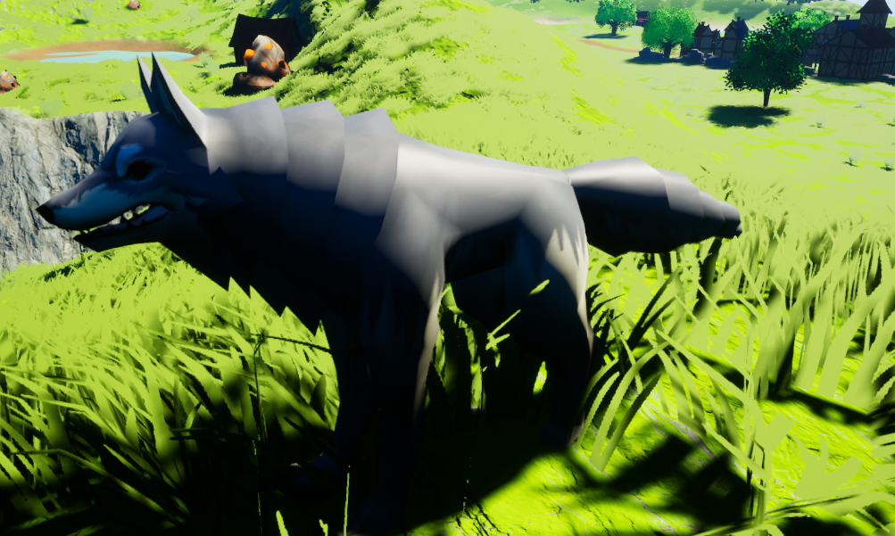

Un prédateur classique qui vit dans les forêts et les montagnes. Il chasse souvent en meute et n’hésite pas à attaquer lorsqu’il détecte une présence étrangère. Non montable.

---

#### 🐻 Ours

Solide et puissant, l’ours est un omnivore qui se montre agressif envers tout intrus. Il possède une capacité spéciale passive : plus sa vie est basse, plus ses attaques deviennent destructrices. Montable.

---

#### 🐑 Mouton

Paisible habitant des plaines, le mouton est une créature purement fuyarde. Il peut être utilisé pour sa laine ou comme monture légère. Très vulnérable.

---

#### 🧬 Tardigramorph

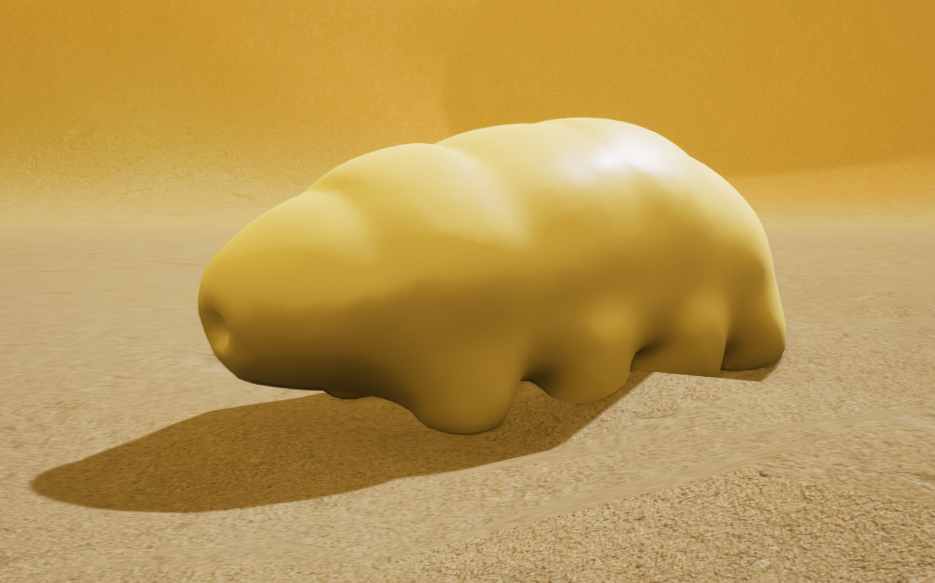

Inspiré du tardigrade terrestre, mais en version géante, ce survivant hors pair est quasi indestructible. Il peut planer dans les airs et possède une immunité totale à l’environnement. Sa capacité spéciale le rend temporairement invincible. Variantes sur Kagami (glace) et Funka (feu).

---

#### 🐍 Slawormon

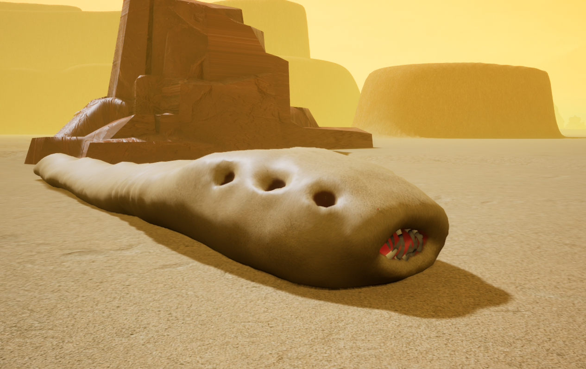

Créature géante et lâche, elle fuit quand elle est blessée mais peut causer de lourds dégâts grâce à sa capacité spéciale : elle crée une secousse dans le sable qui projette ses ennemis dans les airs. Une version orange devient plus rapide quand sa vie est faible.

---

#### 🐫 Muddy

Herbivore massif de Miraju, cette créature fuyarde utilise des tempêtes de sable pour affaiblir ses ennemis et renforcer ses alliés. Sa tempête inflige des dégâts continus tout en restaurant l’endurance des créatures alliées proches.

---

#### 🪨 Golem

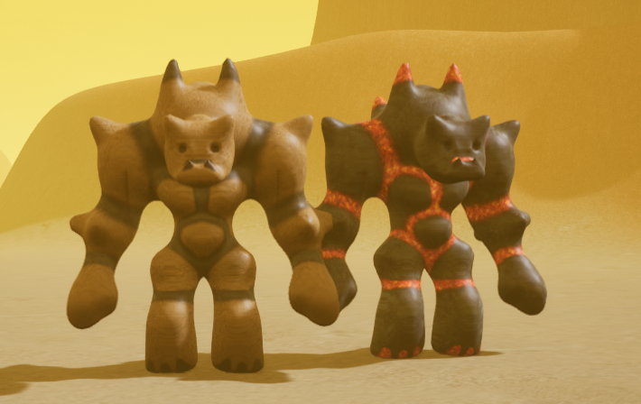

Créature massive de pierre qui habite les déserts de Miraju. Inoffensif tant qu’on ne l’attaque pas, il devient redoutable s’il est provoqué. Il peut lancer des rochers infligeant de lourds dégâts. Existe en variante de feu sur Funka avec rochers enflammés et immunité au feu.

---

#### 🕷️ Aranoïde

Créature nocturne semblable à une araignée géante. Très agressive, elle est capable de projeter des pièges gluants ralentissant ses cibles. Redoutable la nuit.

---

#### 🌱 Sower

Créature végétale vivant dans les forêts sombres de Mitsurin. Elle libère un nuage de graines absorbant l’énergie vitale des ennemis. Peut avoir une variante turquoise qui régénère plus vite sa stamina et draine.

---

#### 🦌 Cerval

Cerf bipède étrange et partiellement carnivore, capable d’endormir ses ennemis grâce à une fumée soporifique. Montable, il combine vitesse et capacités de contrôle. Immunisé contre la torpeur.

---

#### 🧪 Vicilis

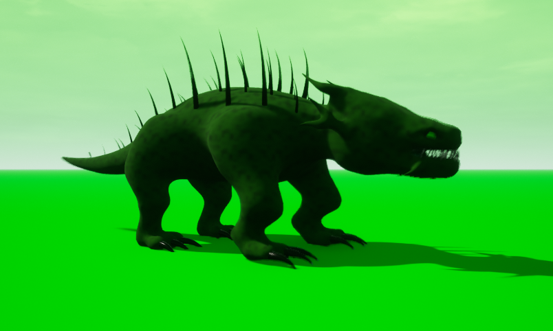

Créature agressive aux crocs empoisonnés. Peut générer des lianes pour piéger ses cibles ou se déplacer. Variante foncée qui paralyse mais ne draine plus. Excellente pour contrôler le champ de bataille.

---

#### 🐘 Bibou

Géant herbivore paisible. Peu mobile mais très résistant, il peut couver les œufs pour augmenter les chances de mutations génétiques. Idéal pour l’élevage.

---

#### 🔥 Salavamandre

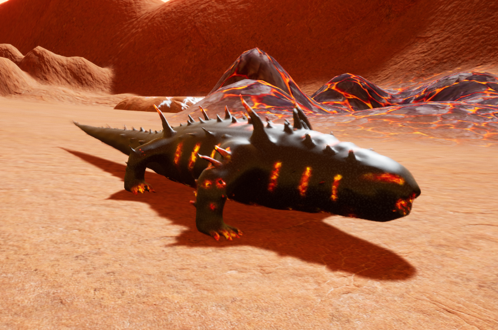

Salamandre volcanique vivant dans les failles. Capable de grimper aux murs et de tirer des boules de lave infligeant des brûlures. Variante orange qui tire trois projectiles moins puissants. Montable.

---

#### 🔥 Chrysomancer

Créature volante enflammée qui s’écrase sur ses ennemis pour causer une explosion. Très rapide et dangereuse. Variante bleue plus endurante mais sans capacité spéciale. Montable.

---

#### 🌋 Erudon

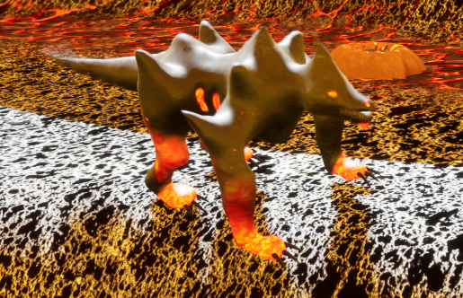

Prédateur massif immunisé au feu. Pose des cratères explosifs sur le sol, très dangereux pour les poursuivants. Idéal pour piéger une zone. Montable.

---

#### ❄️ Snow-Saurus

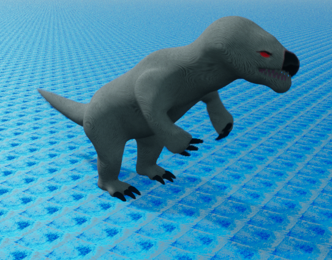

Hybride Rex-Yeti, cette créature est taillée pour le combat dans la neige. Son souffle glacé provoque de lourds dégâts et un recul massif. Variante bleue claire pouvant invoquer des tempêtes de neige. Montable.

---

#### ❄️ Reaper

Créature de glace à griffes extensibles. Peut attaquer à distance et projeter ses ennemis. Très utile pour le crowd control. Immunisé au gel. Montable.

---

#### ❄️ Hazer

Créature semblable à un loup capable de générer des illusions grâce à un blizzard. Redoutable pour tromper et désorienter ses ennemis. Montable.

---

#### ✨ Dazzle

Créature imposante vivant sur Kagami, Dazzle est capable d’aveugler ses ennemis avec sa lumière intense, les empêchant de suivre leur cible pendant un court moment. Montable.

---

#### 🌀 Tronvoïde

Petite créature de Vesus au comportement lâche, capable de se téléporter dans le dos de ses ennemis pour surprendre et attaquer. Active surtout la nuit. Non montable.

---

#### ⛈️ Stormvoker

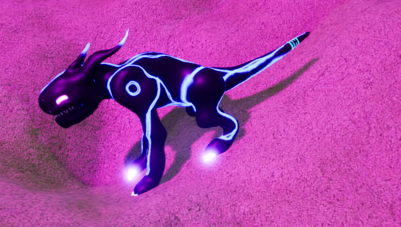

Colosse de Vesus qui invoque des orages dévastateurs, frappant les ennemis de ses éclairs destructeurs. Variante rose : orages plus longs mais moins puissants. Montable.

---

#### ⚛️ Negatron

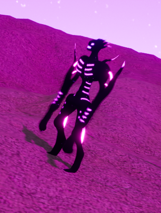

Humanoïde évolué manipulant l'antimatière. Il peut se téléporter avec une onde de choc avant et après sa téléportation. D’une grande agilité et capable de planer. Montable.

---

#### 🌿 Hyppoglow

Créature paisible de Vesus se nourrissant de baies. Elle éclaire les filons brillants à proximité et possède une capacité unique permettant de rajeunir ses alliés. Montable.

---